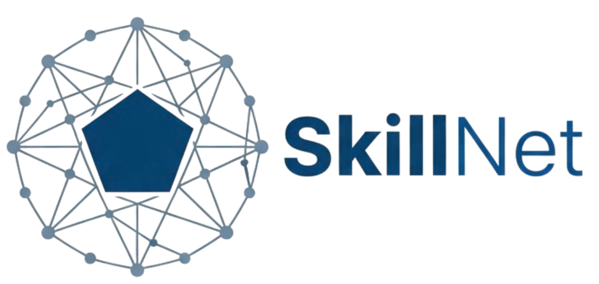

<div align="center">
<a href="http://skillnet.openkg.cn/">
    
</a>

# SkillNet: Create, Evaluate, and Connect AI Skills

[](https://badge.fury.io/py/skillnet-ai)
[](https://opensource.org/licenses/MIT)
[](https://arxiv.org/)
[](http://skillnet.openkg.cn/)

</div>

## 📖 Table of Contents

- [📖 Overview](#-overview)
- [🚀 Features](#-features)
- [🌐 API Access](#-api-access)
- [🐍 Python Toolkit (`skillnet-ai`)](#-python-toolkit-skillnet-ai)
  - [🎬 Quick Start Demo](#-quick-start-demo)
  - [📥 Installation](#-installation)
  - [🛠 Python SDK Usage](#-usage-python-sdk)
  - [💻 CLI Usage](#-cli-usage)
- [🔬 Example Use Case](#-example-use-case)
- [🤖 OpenClaw Integration](#-openclaw-integration)
- [📂 Skill Structure](#-skill-structure)
- [🗺 Roadmap & Contributing](#-roadmap)

---

## 📖 Overview

SkillNet is an open infrastructure for creating, evaluating, and organizing AI skills at scale.


## 🚀 Features

- **🔍 Search**: Find skills using keywords match or semantic search.
- **📦 One-Line Installation**: Download skill packages directly from GitHub repositories.
- **✨ Skill Creation**: Automatically convert various sources into structured, reusable `skills` using LLMs:
  - Execution trajectories / conversation logs
  - GitHub repositories
  - Office documents (PDF, PPT, Word)
  - Direct text prompts
- **📊 Evaluation**: Evaluate and score skills for quality assurance (Safety, Completeness, Executability, Maintainability, Cost-Awareness).
- **🕸️ Relationship Analysis**: Automatically map the connections between skills in your local library, identifying structural relationships between skills (similar_to, belong_to, compose_with, depend_on).

## 🎬 Quick Start Demo

https://github.com/user-attachments/assets/9f9d35b0-36fd-4d7d-a072-39afa380b241

# 🌐 API Access

SkillNet provides a public API to search skills. Support both keywords match and semantic search.

**Base Endpoint:** `http://api-skillnet.openkg.cn/v1/search`

### ⚡ Quick Examples

**1. Keywords Match**

Find "development" tools sorted by stars.

```bash
curl -X GET "http://api-skillnet.openkg.cn/v1/search?q=pdf&sort_by=stars&limit=5" \
     -H "accept: application/json"
```

**2. Vector Semantic Search**

Find skills related to "reading charts" using AI similarity.

```bash
curl -X GET "http://api-skillnet.openkg.cn/v1/search?q=reading%20charts&mode=vector&threshold=0.8" \
     -H "accept: application/json"
```

### 📡 Parameter Reference

| Parameter  | Type   | Required | Default   | Description                                        |
| :--------- | :----- | :------: | :-------- | :------------------------------------------------- |
| `q`        | string |    ✅    | -         | The search query (Keywords or Natural Language).   |
| `mode`     | string |    -     | `keyword` | `keyword` (Fuzzy match) or `vector` (Semantic AI). |
| `category` | string |    -     | `None`    | Filter: Development, AIGC, Research, Science, etc. |
| `limit`    | int    |    -     | `10`      | Results per request (Max: 50).                     |

**Mode Specific Parameters:**

- **Keyword Mode:** `page` (int), `min_stars` (int), `sort_by` (string: `stars` or `recent`)
- **Vector Mode:** `threshold` (float: `0.0` to `1.0`)

### 📦 Response Structure

<details>
<summary>Click to view JSON Response Example</summary>

```json
{
  "data": [
    {
      "skill_name": "pdf-extractor-v1",
      "skill_description": "Extracts text and tables from PDF documents.",
      "author": "openkg-team",
      "stars": 128,
      "skill_url": "http://...",
      "category": "Productivity"
    }
  ],
  "meta": {
    "query": "pdf",
    "mode": "keyword",
    "total": 1,
    "limit": 10,
    ...
  },
  "success": true
}
```

</details>

# 🐍 Python Toolkit (`skillnet-ai`)

**skillnet-ai** is the official Python Toolkit. It functions seamlessly as both a library and a CLI to **Create**, **Evaluate**, and **Organize** skills.

### 📥 Installation

```bash
pip install skillnet-ai
```

### 🛠 Usage (Python SDK)

The `SkillNetClient` is your main entry point.

#### 1. Initialization

```python
from skillnet_ai import SkillNetClient

client = SkillNetClient(
    api_key="sk-...",       # Required for Creation, and Evaluation
    # base_url="...",       # Optional: Custom LLM base URL
    # github_token="ghp-..." # Optional: For private repos or higher rate limits
)
```

#### 2. Search for Skills

Perform keywords match or semantic searches to find skills. (See [Parameter Reference](#-parameter-reference) for configuration details.)

```python
# 1. Standard Keywords Match
results = client.search(q="pdf", mode="keyword", limit=10, min_stars=5, sort_by="stars")

# 2. Semantic Search
results = client.search(q="Help me analyze financial PDF reports", mode="vector", threshold=0.85)

if results:
    top_skill = results[0]
    print(f"Found: {top_skill.skill_name} (Stars: {top_skill.stars})")
    print(f"URL: {top_skill.skill_url}")
```

#### 3. Install Skills

Download and install a skill directly from a URL (e.g., from above search results) into your local workspace.

```python
skill_url = "https://github.com/anthropics/skills/tree/main/skills/skill-creator"

try:
    # Downloads to ./my_agent_skills
    local_path = client.download(url=skill_url, target_dir="./my_agent_skills")
    print(f"Skill successfully installed at: {local_path}")
except Exception as e:
    print(f"Download failed: {e}")
```

#### 4. Create Skills

Turn local trajectory, gitHub repository, office documents or text description into a polished Skill Package (SKILL.md, scripts, etc.).

```python
# 1. Create skill from Local Trajectory
# Prepare your trajectory (e.g., a conversation log string)
trajectory_log = """
User: I need to rename all .jpg files in this folder to .png.
Agent: I will write a python script to iterate through the folder...
Agent: Script executed. Renamed 5 files.
"""
# Generate Skill, Returns a list of paths to the generated skill folders
created_paths = client.create(
    trajectory_content=trajectory_log,
    output_dir="./created_skills",
    model="gpt-4o"
)

# 2. Create skill from GitHub Repository
created_paths = client.create(
    github_url="https://github.com/zjunlp/DeepKE",
    output_dir="./created_skills",
    model="gpt-4o"
)

# 3. Create skill from a office documents (PDF, Word, PPT)
created_paths = client.create(
    office_file="./docs/user_guide.pdf",
    output_dir="./created_skills"
)

# 4. Create skill from a prompt description
created_paths = client.create(
    prompt="Create a skill for web scraping that extracts article titles and content",
    output_dir="./created_skills"
)

print(f"Created {len(created_paths)} new skills.")
for path in created_paths:
    print(f"- {path}")
```

#### 5. Skill Evaluation

Assess the Safety, Completeness, Executability, Maintainability and Cost-Awareness of a skill. Supports both remote GitHub URLs and local directories.

```python
# Evaluate from local directory
# target_skill = "./my_skills/web_search"

# Evaluate from GitHub URL (uses github_token if provided during initialization)
target_skill = "https://github.com/anthropics/skills/tree/main/skills/algorithmic-art"

result = client.evaluate(target=target_skill, model="gpt-4o", cache_dir="./evaluate_cache_dir")
print(f"Evaluation Result: {result}")
```

#### 6. Skill Relationship Analysis

Analyze a local directory containing multiple skills to infer a relationship graph. It identifies relationships like dependencies (depend_on), collaboration (compose_with), hierarchy (belong_to), and alternatives (similar_to).

```python
# Directory containing multiple skill folders
skills_directory = "./my_agent_skills"

# Analyze relationships between skills
# This will also save a 'relationships.json' in the directory by default
relationships = client.analyze(skills_dir=skills_directory, save_to_file=True, model="gpt-4o")

# Display the relationships
for rel in relationships:
    print(f"{rel['source']} --[{rel['type']}]--> {rel['target']}")
    # Output: PDF_Parser --[compose_with]--> Text_Summarizer
```

### 💻 CLI Usage

The CLI is powered by `Typer` and `Rich` for a beautiful terminal experience.

#### Common Commands

| Command        | Action                  | Example                                      |
| :------------- | :---------------------- | :------------------------------------------- |
| **`search`**   | Search skills           | `skillnet search "data viz" --mode vector`   |
| **`download`** | Install skill           | `skillnet download <github_url> -d ./skills` |
| **`create`**   | Create skill            | `skillnet create log.txt --model gpt-4o`     |
| **`evaluate`** | Evaluate skill quality  | `skillnet evaluate ./my_tool`                |
| **`analyze`**  | Analyze skill relations | `skillnet analyze ./my_agent_skills`         |

> **Tip:** Use `skillnet [command] --help` to see all available options (e.g., thresholds, sorting).

#### 1. Search Skills (`search`)

Search the registry using keywords match or semantic search.

```bash
# Basic keywords match
skillnet search "pdf"

# Semantic/Vector search (finds skills by meaning)
skillnet search "Help me analyze financial PDF reports" --mode vector --threshold 0.85

# Filter by category and sort results
skillnet search "visualization" --category "Development" --sort-by stars --limit 10
```

#### 2. Install Skills (`download`)

Download and install a skill directly from a GitHub repository subdirectory.

```bash
# Download to the current directory
skillnet download https://github.com/anthropics/skills/tree/main/skills/algorithmic-art

# Download to a specific target directory
skillnet download https://github.com/anthropics/skills/tree/main/skills/algorithmic-art -d ./my_agent/skills

# Download from a private repository
skillnet download <private_url> --token <your_github_token>
```

#### 3. Create Skills (`create`)

Create structured Skill from various sources using LLMs.

**Linux/macOS:**

```bash
# Requirement: Ensure API_KEY is set in your environment variables.
export API_KEY=sk-xxxxx
export BASE_URL=xxxxxx  # Optional custom LLM base URL
```

**Windows PowerShell:**

```powershell
# Requirement: Ensure API_KEY is set in your environment variables.
$env:API_KEY = "sk-xxxxx"
$env:BASE_URL = "xxxxxx"  # Optional custom LLM base URL
```

**Usage Examples:**

```bash
# From a trajectory file
skillnet create ./logs/trajectory.txt -d ./generated_skills

# From a GitHub repository
skillnet create --github https://github.com/owner/repo

# From an office document (PDF, PPT, Word)
skillnet create --office ./docs/guide.pdf

# From a direct prompt
skillnet create --prompt "Create a skill for extracting tables from images"

# Specify a custom model
skillnet create --office report.pdf --model gpt-4o
```

#### 4. Evaluate Skills (`evaluate`)

Generate a comprehensive quality report (Safety, Completeness, Executability, Maintainability, Cost-Awareness) for a skill.

**Linux/macOS:**

```bash
# Requirement: Ensure API_KEY is set in your environment variables.
export API_KEY=sk-xxxxx
export BASE_URL=xxxxxx  # Optional custom LLM base URL
```

**Windows PowerShell:**

```powershell
# Requirement: Ensure API_KEY is set in your environment variables.
$env:API_KEY = "sk-xxxxx"
$env:BASE_URL = "xxxxxx"  # Optional custom LLM base URL
```

**Usage Examples:**

```bash
# Evaluate a remote skill via GitHub URL
skillnet evaluate https://github.com/anthropics/skills/tree/main/skills/algorithmic-art

# Evaluate a local skill directory
skillnet evaluate ./my_skills/web_search

# Custom evaluation config
skillnet evaluate ./my_skills/tool --category "Development" --model gpt-4o
```

#### 5. Analyze Relationships (`analyze`)

Scan a local directory of skills to analyze their connections using AI.

**Linux/macOS:**

```bash
# Requirement: Ensure API_KEY is set in your environment variables.
export API_KEY=sk-xxxxx
export BASE_URL=xxxxxx  # Optional custom LLM base URL
```

**Windows PowerShell:**

```powershell
# Requirement: Ensure API_KEY is set in your environment variables.
$env:API_KEY = "sk-xxxxx"
$env:BASE_URL = "xxxxxx"  # Optional custom LLM base URL
```

**Usage Examples:**

```bash
# Analyze a directory containing multiple skill folders
skillnet analyze ./my_agent_skills

# Analyze without saving the result file (just print to console)
skillnet analyze ./my_agent_skills --no-save

# Specify a model for the analysis
skillnet analyze ./my_agent_skills --model gpt-4o
```

### Environment Configuration

To use **Creation**, **Evaluation**, or **Analyze** features, set your environment variables:

**Linux/macOS:**

```bash
export API_KEY="your_api_key"
export BASE_URL="https://xxxxx"  # Optional
```

**Windows PowerShell:**

```powershell
$env:API_KEY = "your_api_key"
$env:BASE_URL = "https://xxxxx"  # Optional
```

---

## 🔬 Example Use Case

To demonstrate the power of SkillNet, we provide a complete example of a Scientific Discovery. This scenario demonstrates how an AI Agent leverages the SkillNet infrastructure to autonomously plan and execute a complex scientific mission—from raw data processing to clinical validation.

<div align="center">  </div>

👉 **[Try the Interactive Demo (Website: Scenarios->Science)](http://skillnet.openkg.cn/)**

### 🧬 Workflow Lifecycle

- Task Definition: User provides a goal: "Analyze scRNA-seq data to find cancer targets."
- AI Planning: The Agent decomposes the mission into logical steps (Data $\rightarrow$ Mechanism $\rightarrow$ Validation $\rightarrow$ Report).
- Skill Discovery: The Agent uses client.search() to find specialized skills like cellxgene-census and kegg-database.
- Acquisition & Orchestration: Skills are downloaded, quality-evaluated via client.evaluate(), and mapped for dependencies.
- Execution: The skills are executed sequentially to generate a final discovery report.

### 🚀 Try it yourself

You can explore the full implementation, in our interactive Jupyter Notebook:

👉 **[View Scientific Discovery Demo (Notebook)](https://github.com/zjunlp/SkillNet/blob/main/examples/scientific_workflow_demo.ipynb)**

---

## 🤖 OpenClaw Integration

SkillNet integrates with [OpenClaw](https://github.com/openclaw/openclaw) (open-source personal AI agent framework) as a built-in, lazy-loaded skill. You do **not** need OpenClaw's source code — only a working OpenClaw install. Once loaded, the agent automatically:

- **Searches & applies** existing skills before tackling complex or unfamiliar tasks
- **Creates skills** from GitHub repos, documents (PDF/PPT/Word), or completed work via `skillnet create`
- **Evaluates & analyzes** your local skill library for quality scores and inter-skill relationships

This forms a closed loop: community skills guide execution → successful outcomes become new skills → periodic analysis keeps the library clean.

<div align="center">  </div>

### 📋 Prerequisites

- [OpenClaw](https://github.com/openclaw/openclaw) installed with a configured workspace (default: `~/.openclaw/workspace`)
- No OpenClaw repo checkout is required

### 📥 Install via ClawHub (Recommended)

**Option A — CLI:**

```bash
# 1. Install ClawHub CLI (once)
npm i -g clawhub

# 2. Install the skill into your OpenClaw workspace (pick one)
cd ~/.openclaw/workspace && clawhub install skillnet
# — or from anywhere —
clawhub install skillnet --workdir ~/.openclaw/workspace

# 3. Restart OpenClaw so it discovers the new skill
openclaw gateway restart   # or simply start a new chat session
```

**Option B — Via OpenClaw chat:**

Simply tell your agent:

```
Install the skillnet skill from ClawHub.
```

The skill lands at `<workspace>/skills/skillnet` — workspace skills take precedence over global and bundled ones.

### 🧪 Quick Verification

In your OpenClaw chat, try:

```
Search SkillNet for a "docker" skill and summarize the top result.
```

```
Create a skill from this GitHub repo: https://github.com/owner/repo (then evaluate it).
```

> 👉 The source of this skill package is also available at [`skills/skillnet/`](skills/skillnet/) for reference, but the recommended install method is via **ClawHub** as shown above.

---

## 📂 Skill Structure

Standardized structure for all SkillNet packages:

```text
skill-name/
├── SKILL.md          # [Required] Metadata (YAML) + Instructions
├── scripts/          # [Optional] Executable Python/Bash scripts
├── references/       # [Optional] Static docs or API specs
└── assets/           # [Optional] Icons, templates, examples
```

---

## 🗺 Roadmap

- ✅ Keyword Match & Semantic Search
- ✅ Skill Installer
- ✅ Skill Creator (Local File & GitHub Repository)
- ✅ Skill Evaluation & Scoring
- ✅ Skill Relationship Analysis

## 🤝 Contributing

Contributions are welcome! Please submit a Pull Request or open an Issue on GitHub.

## 📄 License

This project is licensed under the [MIT License](LICENSE).
